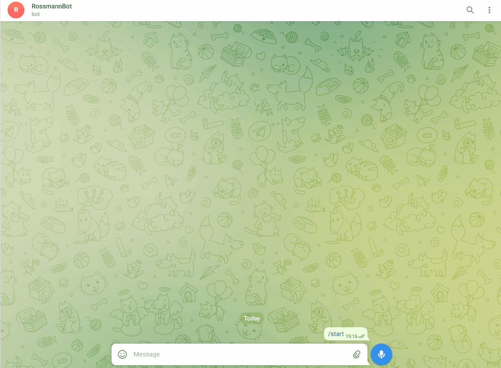

# Rossmann Sales Forecast

Versão em  [português (BR)](https://github.com/alyssonvidal/Rossmann-Sales-Forecast/blob/main/referenses/README_PT.md)

## Problem Statement

Rossmann operates over 3,000 drug stores in 7 European countries. Currently, Rossmann store managers are tasked with predicting their daily sales for up to six weeks in advance. Store sales are influenced by many factors, including promotions, competition, school and state holidays, seasonality, and locality. With thousands of individual managers predicting sales based on their unique circumstances, the accuracy of results can be quite varied.

## Objective
**Main:**
* Analyze the given database and create insights about the products supplied, the stores, business sales strategies, etc.
* Develop a machine learning mode capable of forecasting sales for each store in up to six weeks.

**Extra:**    
* Create a telegram bot that reports sales forecasts.

## Development Stages
* Business Knowledge
    -   Deep study of features...
* Data Preprocessing
    -   Dealing with missing, duplicated and bad values, fixing data types, feature engineering, data inputation...  
* Exploratory Data Analysis
    -   Descriptive statistics, hypothesis mental map, univariate, bivariate and multivariate analysis 
* Data Preparation
    -   Normalization, Standardization, Encoding, Outlines
* Machine Learning Predictive Model
    -   SARIMAX, Random Forest Regressor, XGBoost Regressor
* Deploy
    -   Rossmann API on cloud
    
## Reports
* Project Presentation
* Business Avaliation
* Model Performace

## Tools
* Languages: Python
* IDE: Visual Studio Code, Jupyter Notebook
* Libraries: Pandas, Matplotlib, Seaborn, Sklearn, statsmodel
* Frameworks: Flask
* Deploy: Heroku
* Methodology: CRISP-DM

*** 

## Brefing 

